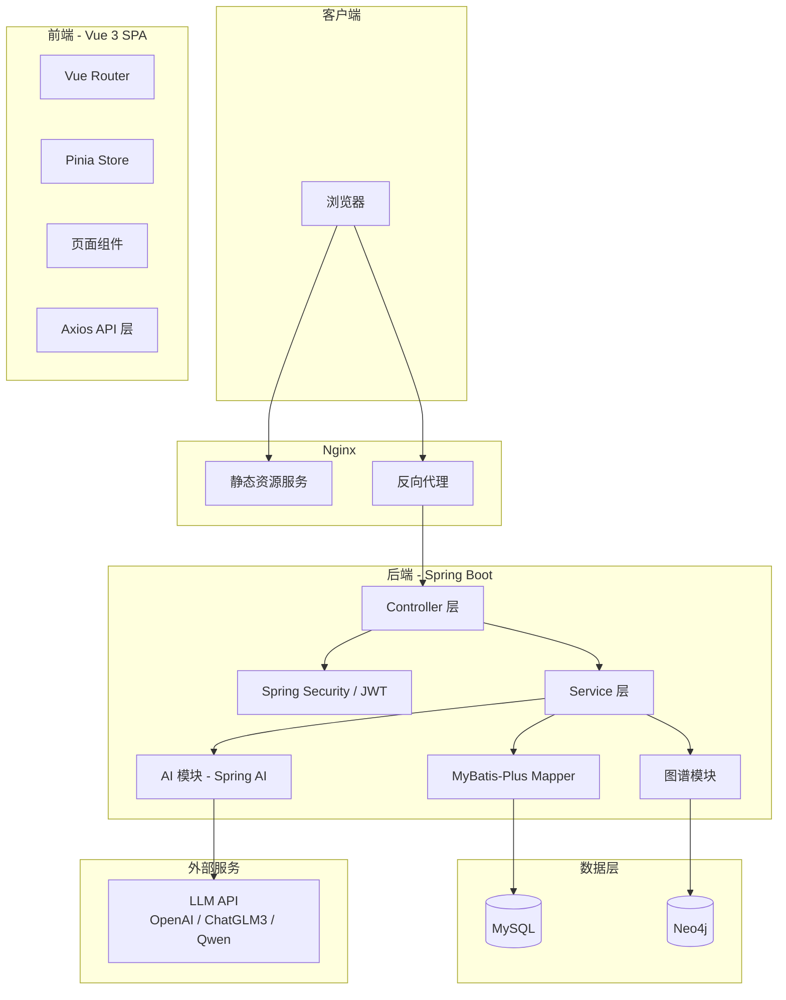
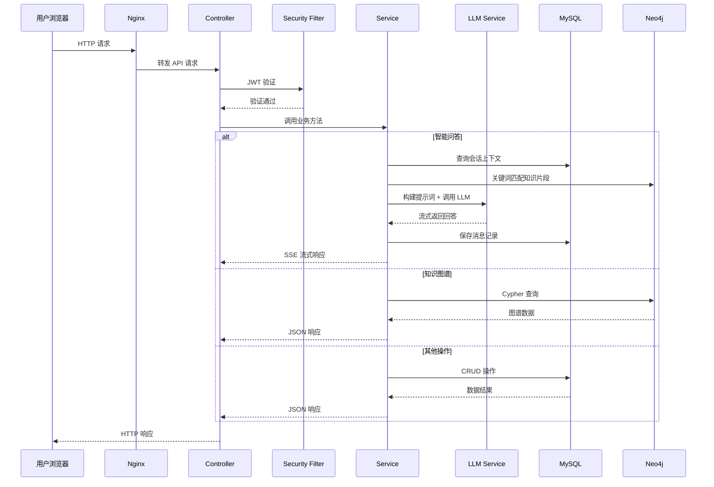

# 技术设计文档

## 概述

智能编程学习助手是一个全栈 Web 应用，为编程学习者提供 AI 驱动的智能问答、知识图谱可视化导航、个性化学习路径推荐、代码片段管理和学习进度跟踪功能。

系统采用前后端分离架构：
- 前端基于 Vue 3 + Vite + Element Plus 构建 SPA 应用
- 后端基于 Spring Boot 提供 RESTful API
- 数据层使用 MySQL 存储关系数据，Neo4j 存储知识图谱
- AI 层通过 Spring AI 封装多 LLM 提供者调用
- 部署层使用 Docker Compose 编排所有服务

当前版本暂不引入 Redis 和 Elasticsearch/向量数据库，知识检索采用关键词匹配方式实现。

## 架构

### 整体架构图



### 分层架构

系统采用经典的分层架构，各层职责清晰：

| 层级 | 技术 | 职责 |
|------|------|------|
| 表现层 | Vue 3 + Element Plus | 用户界面渲染、交互处理 |
| 网关层 | Nginx | 静态资源服务、API 反向代理 |
| 接口层 | Spring MVC Controller | 请求路由、参数校验、响应封装 |
| 认证层 | Spring Security + JWT | 身份验证、权限控制 |
| 业务层 | Spring Service | 核心业务逻辑 |
| AI 层 | Spring AI | LLM 调用抽象、提示词管理 |
| 数据访问层 | MyBatis-Plus / Neo4j Driver | 数据库 CRUD 操作 |
| 存储层 | MySQL + Neo4j | 数据持久化 |

### 请求处理流程



## 组件与接口

### 前端组件

#### 页面组件

| 组件 | 路由 | 功能 |
|------|------|------|
| AuthView | `/login`, `/register` | 用户登录与注册 |
| ChatView | `/chat` | 智能问答界面，支持多轮对话和流式响应 |
| KnowledgeGraphView | `/graph` | 知识图谱可视化与交互 |
| LearningPathView | `/path` | 学习路径展示与管理 |
| CodeSnippetsView | `/snippets` | 代码片段 CRUD 管理 |
| DashboardView | `/dashboard` | 学习进度仪表盘 |
| ProfileView | `/profile` | 用户个人中心 |

#### 核心公共组件

| 组件 | 功能 |
|------|------|
| CodeEditor | 基于 Monaco Editor 封装，支持多语言语法高亮、一键复制 |
| GraphRenderer | 基于 ECharts/G6 封装，支持缩放、拖拽、节点着色、关系标签 |
| MessageBubble | 问答消息气泡，区分用户/助手角色，支持代码块渲染 |
| FeedbackButton | 答案反馈组件（有用/无用） |
| PathTimeline | 学习路径时间线/流程图组件 |

#### 前端状态管理（Pinia Stores）

| Store | 状态 | 职责 |
|-------|------|------|
| useAuthStore | user, token, isAuthenticated | 用户认证状态、JWT 令牌管理 |
| useChatStore | conversations, currentConversation, messages | 会话列表、当前会话消息 |
| useGraphStore | nodes, edges, selectedNode | 图谱数据、选中节点 |
| usePathStore | paths, currentPath | 学习路径列表、当前路径 |
| useSnippetStore | snippets, filters | 代码片段列表、筛选条件 |
| useProgressStore | dashboard, heatmap, radar | 学习进度统计数据 |

#### 前端 API 层（Axios 封装）

```typescript
// api/request.ts - Axios 实例配置
// - baseURL 指向 /api
// - 请求拦截器：自动附加 JWT Authorization header
// - 响应拦截器：统一处理 401（跳转登录）、错误提示

// api/auth.ts
export const authApi = {
  register(data: RegisterDTO): Promise<ApiResponse<UserVO>>,
  login(data: LoginDTO): Promise<ApiResponse<TokenVO>>,
  logout(): Promise<ApiResponse<void>>
}

// api/chat.ts
export const chatApi = {
  sendMessage(conversationId: string | null, content: string): EventSource,  // SSE
  getConversations(): Promise<ApiResponse<ConversationVO[]>>,
  getMessages(conversationId: string): Promise<ApiResponse<MessageVO[]>>,
  deleteConversation(id: string): Promise<ApiResponse<void>>,
  submitFeedback(data: FeedbackDTO): Promise<ApiResponse<void>>
}

// api/graph.ts
export const graphApi = {
  getOverview(): Promise<ApiResponse<GraphVO>>,
  getNodeDetail(id: string): Promise<ApiResponse<KnowledgeNodeVO>>,
  getNeighbors(id: string): Promise<ApiResponse<GraphVO>>,
  search(keyword: string): Promise<ApiResponse<KnowledgeNodeVO[]>>
}

// api/path.ts
export const pathApi = {
  generate(data: PathGenerateDTO): Promise<ApiResponse<LearningPathVO>>,
  list(): Promise<ApiResponse<LearningPathVO[]>>,
  updateNodeStatus(nodeId: string, status: string): Promise<ApiResponse<void>>
}

// api/snippet.ts
export const snippetApi = {
  create(data: SnippetDTO): Promise<ApiResponse<SnippetVO>>,
  list(params: SnippetQueryDTO): Promise<ApiResponse<PageResult<SnippetVO>>>,
  recommend(conversationId: string): Promise<ApiResponse<SnippetVO[]>>,
  update(id: string, data: SnippetDTO): Promise<ApiResponse<void>>,
  delete(id: string): Promise<ApiResponse<void>>,
  exportAll(): Promise<Blob>,
  importFile(file: File): Promise<ApiResponse<ImportResultVO>>
}

// api/progress.ts
export const progressApi = {
  getDashboard(): Promise<ApiResponse<DashboardVO>>,
  getHeatmap(year: number): Promise<ApiResponse<HeatmapVO>>,
  getRadar(): Promise<ApiResponse<RadarVO>>,
  getReport(): Promise<Blob>  // PDF
}
```

### 后端组件

#### Controller 层

| Controller | 路径前缀 | 职责 |
|------------|----------|------|
| AuthController | `/api/auth` | 注册、登录、登出 |
| ChatController | `/api/chat` | 问答消息发送（SSE）、会话管理、反馈 |
| GraphController | `/api/graph` | 图谱概览、节点详情、邻居查询、搜索 |
| PathController | `/api/path` | 路径生成、列表查询、节点状态更新 |
| SnippetController | `/api/snippets` | 代码片段 CRUD、推荐、导入导出 |
| ProgressController | `/api/progress` | 仪表盘、热力图、雷达图、报告导出 |

#### Service 层

| Service | 职责 |
|---------|------|
| AuthService | 用户注册（BCrypt 加密）、登录验证、JWT 生成与校验 |
| ChatService | 会话管理、消息存储、知识检索、LLM 调用编排、SSE 流式推送 |
| KnowledgeRetrievalService | 关键词匹配知识片段、构建 LLM 上下文提示词 |
| LlmService | 统一 LLM 调用抽象接口，支持 OpenAI/ChatGLM3/Qwen 切换 |
| GraphService | Neo4j 图谱查询、节点详情、邻居扩展、关键词搜索 |
| PathService | 学习路径生成（基于图谱拓扑排序）、路径管理、节点状态更新 |
| SnippetService | 代码片段 CRUD、标签/关键词搜索、上下文推荐、JSON 导入导出 |
| ProgressService | 学习行为记录、统计数据聚合、热力图/雷达图数据计算、PDF 报告生成 |
| FeedbackService | 答案反馈记录、去重校验 |

#### LLM 抽象接口设计

```java
// LLM 提供者统一接口
public interface LlmProvider {
    /**
     * 流式调用 LLM，返回 Flux 用于 SSE 推送
     */
    Flux<String> chatStream(List<ChatMessage> messages, String systemPrompt);
    
    /**
     * 同步调用 LLM
     */
    String chat(List<ChatMessage> messages, String systemPrompt);
}

// 具体实现
public class OpenAiProvider implements LlmProvider { ... }
public class ChatGlmProvider implements LlmProvider { ... }
public class QwenProvider implements LlmProvider { ... }

// 工厂/策略模式，通过配置切换
@Component
public class LlmProviderFactory {
    @Value("${llm.provider}")
    private String providerName;
    
    public LlmProvider getProvider() { ... }
}
```

#### Spring Security + JWT 配置

```java
// JWT 认证流程
// 1. 登录成功 → 生成 JWT（包含 userId, username, 过期时间）
// 2. 请求拦截 → JwtAuthenticationFilter 从 Header 提取 token
// 3. 验证 token → 解析 userId，设置 SecurityContext
// 4. 登出 → 客户端删除 token（无状态方案，不维护黑名单）

@Configuration
@EnableWebSecurity
public class SecurityConfig {
    // 公开路径：/api/auth/register, /api/auth/login
    // 其余路径需 JWT 认证
}
```

### 核心接口定义

#### 统一响应格式

```java
public class ApiResponse<T> {
    private int code;        // 业务状态码，200 成功
    private String message;  // 提示信息
    private T data;          // 响应数据
}
```

#### 认证模块接口

| 方法 | 路径 | 请求体 | 响应体 | 说明 |
|------|------|--------|--------|------|
| POST | `/api/auth/register` | `{username, password, email}` | `ApiResponse<UserVO>` | 注册，密码 ≥ 8 位 |
| POST | `/api/auth/login` | `{username, password}` | `ApiResponse<TokenVO>` | 登录，返回 JWT |
| POST | `/api/auth/logout` | - | `ApiResponse<void>` | 登出 |

#### 智能问答模块接口

| 方法 | 路径 | 请求/参数 | 响应体 | 说明 |
|------|------|-----------|--------|------|
| POST | `/api/chat/send` | `{conversationId?, content}` | SSE `text/event-stream` | 流式问答，conversationId 为空则新建会话 |
| GET | `/api/chat/conversations` | - | `ApiResponse<List<ConversationVO>>` | 会话列表，按更新时间倒序 |
| GET | `/api/chat/conversations/{id}/messages` | - | `ApiResponse<List<MessageVO>>` | 会话消息列表 |
| DELETE | `/api/chat/conversations/{id}` | - | `ApiResponse<void>` | 删除会话及消息 |
| POST | `/api/chat/feedback` | `{messageId, rating, comment?}` | `ApiResponse<void>` | 提交反馈 |

#### 知识图谱模块接口

| 方法 | 路径 | 参数 | 响应体 | 说明 |
|------|------|------|--------|------|
| GET | `/api/graph/overview` | - | `ApiResponse<GraphVO>` | 图谱概览（节点+关系） |
| GET | `/api/graph/node/{id}` | - | `ApiResponse<KnowledgeNodeVO>` | 节点详情 |
| GET | `/api/graph/node/{id}/neighbors` | - | `ApiResponse<GraphVO>` | 关联节点（懒加载） |
| GET | `/api/graph/search` | `keyword` | `ApiResponse<List<KnowledgeNodeVO>>` | 搜索知识点 |

#### 学习路径模块接口

| 方法 | 路径 | 请求/参数 | 响应体 | 说明 |
|------|------|-----------|--------|------|
| POST | `/api/path/generate` | `{target, knownKnowledgeIds?}` | `ApiResponse<LearningPathVO>` | 生成学习路径 |
| GET | `/api/path/list` | - | `ApiResponse<List<LearningPathVO>>` | 路径列表 |
| PUT | `/api/path/node/{id}/status` | `{status}` | `ApiResponse<void>` | 更新节点状态 |

#### 代码片段模块接口

| 方法 | 路径 | 请求/参数 | 响应体 | 说明 |
|------|------|-----------|--------|------|
| POST | `/api/snippets` | `{title, code, language, description, tags}` | `ApiResponse<SnippetVO>` | 创建片段 |
| GET | `/api/snippets` | `keyword?, tag?, page, size` | `ApiResponse<PageResult<SnippetVO>>` | 列表查询 |
| GET | `/api/snippets/recommend` | `conversationId` | `ApiResponse<List<SnippetVO>>` | 上下文推荐 |
| PUT | `/api/snippets/{id}` | `{title, code, language, description, tags}` | `ApiResponse<void>` | 更新片段 |
| DELETE | `/api/snippets/{id}` | - | `ApiResponse<void>` | 删除片段 |
| GET | `/api/snippets/export` | - | `application/json` 文件 | 导出 JSON |
| POST | `/api/snippets/import` | `multipart/form-data` | `ApiResponse<ImportResultVO>` | 导入 JSON |

#### 学习进度模块接口

| 方法 | 路径 | 参数 | 响应体 | 说明 |
|------|------|------|--------|------|
| GET | `/api/progress/dashboard` | - | `ApiResponse<DashboardVO>` | 仪表盘统计 |
| GET | `/api/progress/heatmap` | `year` | `ApiResponse<HeatmapVO>` | 热力图数据 |
| GET | `/api/progress/radar` | - | `ApiResponse<RadarVO>` | 雷达图数据 |
| GET | `/api/progress/report` | - | `application/pdf` | 学习报告 PDF |

## 数据模型

### MySQL 数据模型

#### 用户表 (user)

| 字段 | 类型 | 约束 | 说明 |
|------|------|------|------|
| id | BIGINT | PK, AUTO_INCREMENT | 主键 |
| username | VARCHAR(50) | UNIQUE, NOT NULL | 用户名 |
| password | VARCHAR(255) | NOT NULL | BCrypt 加密密码 |
| email | VARCHAR(100) | UNIQUE, NOT NULL | 邮箱 |
| avatar | VARCHAR(255) | | 头像 URL |
| level | VARCHAR(20) | DEFAULT 'beginner' | 用户等级 |
| created_at | DATETIME | NOT NULL | 创建时间 |
| updated_at | DATETIME | NOT NULL | 更新时间 |

#### 会话表 (conversation)

| 字段 | 类型 | 约束 | 说明 |
|------|------|------|------|
| id | BIGINT | PK, AUTO_INCREMENT | 主键 |
| user_id | BIGINT | FK → user.id, NOT NULL | 所属用户 |
| title | VARCHAR(200) | NOT NULL | 会话标题（取首条消息摘要） |
| created_at | DATETIME | NOT NULL | 创建时间 |
| updated_at | DATETIME | NOT NULL | 更新时间 |

#### 消息表 (message)

| 字段 | 类型 | 约束 | 说明 |
|------|------|------|------|
| id | BIGINT | PK, AUTO_INCREMENT | 主键 |
| conversation_id | BIGINT | FK → conversation.id, NOT NULL | 所属会话 |
| role | VARCHAR(20) | NOT NULL | 角色：user / assistant |
| content | TEXT | NOT NULL | 消息内容 |
| sources | JSON | | 知识来源引用（知识点 ID 列表） |
| created_at | DATETIME | NOT NULL | 创建时间 |

#### 反馈表 (feedback)

| 字段 | 类型 | 约束 | 说明 |
|------|------|------|------|
| id | BIGINT | PK, AUTO_INCREMENT | 主键 |
| message_id | BIGINT | FK → message.id, NOT NULL | 关联消息 |
| user_id | BIGINT | FK → user.id, NOT NULL | 反馈用户 |
| rating | VARCHAR(10) | NOT NULL | 评分：useful / useless |
| comment | TEXT | | 文字评论 |
| created_at | DATETIME | NOT NULL | 创建时间 |

唯一约束：`UNIQUE(message_id, user_id)` — 每用户每消息仅一次反馈

#### 代码片段表 (code_snippet)

| 字段 | 类型 | 约束 | 说明 |
|------|------|------|------|
| id | BIGINT | PK, AUTO_INCREMENT | 主键 |
| user_id | BIGINT | FK → user.id, NOT NULL | 所属用户 |
| title | VARCHAR(200) | NOT NULL | 标题 |
| code | TEXT | NOT NULL | 代码内容 |
| language | VARCHAR(30) | NOT NULL | 编程语言 |
| description | TEXT | | 描述 |
| tags | JSON | | 标签列表 |
| use_count | INT | DEFAULT 0 | 使用次数（用于推荐排序） |
| created_at | DATETIME | NOT NULL | 创建时间 |
| updated_at | DATETIME | NOT NULL | 更新时间 |

#### 学习路径表 (learning_path)

| 字段 | 类型 | 约束 | 说明 |
|------|------|------|------|
| id | BIGINT | PK, AUTO_INCREMENT | 主键 |
| user_id | BIGINT | FK → user.id, NOT NULL | 所属用户 |
| target | VARCHAR(200) | NOT NULL | 学习目标描述 |
| status | VARCHAR(20) | DEFAULT 'active' | 路径状态：active / completed / archived |
| created_at | DATETIME | NOT NULL | 创建时间 |
| updated_at | DATETIME | NOT NULL | 更新时间 |

#### 路径节点表 (learning_node)

| 字段 | 类型 | 约束 | 说明 |
|------|------|------|------|
| id | BIGINT | PK, AUTO_INCREMENT | 主键 |
| path_id | BIGINT | FK → learning_path.id, NOT NULL | 所属路径 |
| knowledge_id | VARCHAR(100) | NOT NULL | Neo4j 知识节点 ID |
| node_order | INT | NOT NULL | 节点顺序 |
| status | VARCHAR(20) | DEFAULT 'todo' | 状态：todo / doing / done / skipped |
| resource_urls | JSON | | 推荐学习资源列表 |

#### 学习记录表 (learning_record)

| 字段 | 类型 | 约束 | 说明 |
|------|------|------|------|
| id | BIGINT | PK, AUTO_INCREMENT | 主键 |
| user_id | BIGINT | FK → user.id, NOT NULL | 所属用户 |
| action_type | VARCHAR(30) | NOT NULL | 行为类型：chat / graph_view / path_complete / snippet_use |
| target_id | VARCHAR(100) | | 目标对象 ID |
| created_at | DATETIME | NOT NULL | 创建时间 |

索引：`INDEX(user_id, created_at)` — 用于按时间范围查询用户学习记录

### Neo4j 数据模型

#### 节点类型

**Knowledge（知识点）**

| 属性 | 类型 | 说明 |
|------|------|------|
| id | String | 唯一标识 |
| name | String | 知识点名称 |
| category | String | 分类：language / framework / database / tool / concept |
| description | String | 描述 |
| difficulty | String | 难度：beginner / intermediate / advanced |
| keywords | List\<String\> | 关键词列表（用于关键词匹配检索） |

**Resource（学习资源）**

| 属性 | 类型 | 说明 |
|------|------|------|
| id | String | 唯一标识 |
| title | String | 资源标题 |
| url | String | 资源链接 |
| type | String | 类型：doc / video / exercise |

#### 关系类型

| 关系 | 起点 → 终点 | 说明 |
|------|-------------|------|
| DEPENDS_ON | Knowledge → Knowledge | 前置知识依赖 |
| CONTAINS | Knowledge → Knowledge | 包含子知识点 |
| RELATED_TO | Knowledge → Knowledge | 关联知识 |
| HAS_RESOURCE | Knowledge → Resource | 关联学习资源 |

#### 关键 Cypher 查询示例

```cypher
// 图谱概览 - 获取所有知识节点和关系
MATCH (k:Knowledge)
OPTIONAL MATCH (k)-[r]->(k2:Knowledge)
RETURN k, r, k2 LIMIT 500

// 节点邻居懒加载
MATCH (k:Knowledge {id: $nodeId})-[r]-(neighbor:Knowledge)
RETURN k, r, neighbor

// 关键词搜索知识节点
MATCH (k:Knowledge)
WHERE k.name CONTAINS $keyword OR ANY(kw IN k.keywords WHERE kw CONTAINS $keyword)
RETURN k

// 学习路径生成 - 拓扑排序（从目标节点反向遍历依赖）
MATCH path = (target:Knowledge {id: $targetId})<-[:DEPENDS_ON*]-(dep:Knowledge)
WHERE NOT (dep)<-[:DEPENDS_ON]-()
RETURN nodes(path)
```

## 正确性属性

*属性（Property）是指在系统所有有效执行中都应保持为真的特征或行为——本质上是对系统应做什么的形式化陈述。属性是人类可读规格说明与机器可验证正确性保证之间的桥梁。*

### 属性 1：有效注册创建用户并返回用户信息

*对于任意*合法的注册数据（用户名、密码 ≥ 8 位、邮箱），注册请求应成功创建用户，且响应中应包含与提交数据一致的用户名和邮箱。

**验证需求：1.1, 1.2**

### 属性 2：重复注册被拒绝

*对于任意*已存在的用户，使用相同的用户名或邮箱再次注册应返回错误，且不会创建新用户。

**验证需求：1.3**

### 属性 3：弱密码被拒绝

*对于任意*长度小于 8 位的密码字符串，注册请求应被拒绝，且不会创建用户。

**验证需求：1.4**

### 属性 4：密码加密存储

*对于任意*注册成功的用户，数据库中存储的密码字段值不应等于用户提交的明文密码，且应为有效的 BCrypt 哈希值。

**验证需求：1.5, 18.4**

### 属性 5：有效凭据返回 JWT 令牌

*对于任意*已注册用户，使用正确的用户名和密码登录应返回有效的 JWT 令牌，该令牌可用于访问受保护的 API。

**验证需求：2.1, 2.3, 18.1**

### 属性 6：无效凭据返回统一错误

*对于任意*错误的用户名或密码组合，登录请求应返回相同的通用错误信息，不泄露具体是用户名还是密码错误。

**验证需求：2.2**

### 属性 7：无效 JWT 令牌被拒绝

*对于任意*过期、篡改或格式错误的 JWT 令牌，携带该令牌访问受保护 API 应返回 401 状态码。

**验证需求：2.4**

### 属性 8：问答调用 LLM 并携带历史上下文

*对于任意*包含 N 条历史消息的会话，发送新问题时，传递给 LLM 的消息列表应包含该会话的所有历史消息。

**验证需求：3.1, 3.5**

### 属性 9：关键词匹配检索知识片段

*对于任意*包含已知关键词的问题，知识检索服务应返回关键词匹配的知识节点，且检索到的知识片段应被拼接到 LLM 提示词中，消息记录的 sources 字段应包含对应的知识点标识。

**验证需求：4.1, 4.2, 4.3**

### 属性 10：会话自动创建

*对于任意*不携带 conversationId 的首次提问，系统应自动创建新会话，且会话标题应基于首条消息内容生成。

**验证需求：5.1**

### 属性 11：会话列表按时间倒序排列

*对于任意*用户的多个会话，会话列表查询结果应按 updated_at 降序排列。

**验证需求：5.2**

### 属性 12：会话消息完整性

*对于任意*包含 N 条消息的会话，查询该会话的消息列表应返回全部 N 条消息。

**验证需求：5.3**

### 属性 13：会话删除级联清理

*对于任意*会话，删除后该会话及其所有关联消息均不可查询。

**验证需求：5.4**

### 属性 14：用户数据隔离

*对于任意*两个不同用户，用户 A 不应能访问、修改或删除用户 B 的会话、代码片段或学习记录。

**验证需求：5.5, 11.6, 14.3**

### 属性 15：反馈记录与去重

*对于任意*消息和用户，提交反馈应持久化评分和评论并关联到正确的消息；同一用户对同一消息的第二次反馈提交应被拒绝。

**验证需求：6.1, 6.2, 6.3**

### 属性 16：图谱数据 JSON 格式返回

*对于任意* Neo4j 中的知识图谱数据，API 返回的 JSON 应包含节点列表和关系列表，每个节点包含 id、name、category 等必要字段。

**验证需求：7.1**

### 属性 17：知识节点详情完整性

*对于任意*知识节点，查询其详情应返回包含名称、分类、描述、难度的完整信息。

**验证需求：8.1**

### 属性 18：图谱分类筛选正确性

*对于任意*分类筛选条件，返回的所有知识节点应属于指定分类。

**验证需求：8.4**

### 属性 19：图谱关键词搜索正确性

*对于任意*搜索关键词，返回的知识节点的名称或关键词列表中应包含该关键词。

**验证需求：8.5**

### 属性 20：学习路径拓扑排序正确性

*对于任意*生成的学习路径，若节点 A 依赖节点 B（A DEPENDS_ON B），则 B 在路径中的位置应在 A 之前；路径应排除用户已掌握的知识节点；每个节点应包含知识点信息和推荐学习资源。

**验证需求：9.1, 9.2, 9.3**

### 属性 21：路径节点状态更新往返一致性

*对于任意*路径节点和有效状态值（todo/doing/done/skipped），更新状态后查询该节点应返回更新后的状态。

**验证需求：10.2**

### 属性 22：代码片段 CRUD 往返一致性

*对于任意*有效的代码片段数据，创建后查询应返回一致的数据；更新后查询应返回更新后的数据；删除后查询应不再返回该片段。

**验证需求：11.1, 11.3, 11.4**

### 属性 23：代码片段标签过滤与搜索正确性

*对于任意*标签过滤条件，返回的代码片段应包含指定标签；*对于任意*关键词搜索，返回的代码片段的标题、描述或代码中应包含该关键词。

**验证需求：11.2**

### 属性 24：代码片段上下文推荐相关性

*对于任意*问答上下文，推荐的代码片段应与上下文关键词相关，且按相关度排序。

**验证需求：12.1, 12.2**

### 属性 25：代码片段导入导出往返一致性

*对于任意*有效的代码片段集合，导出为 JSON 后再导入应产生与原始数据等价的代码片段记录。

**验证需求：13.4**

### 属性 26：学习行为自动记录

*对于任意*用户行为（问答、浏览图谱、完成路径节点），系统应创建包含正确行为类型、目标 ID 和时间戳的学习记录，并持久化到数据库。

**验证需求：14.1, 14.2**

### 属性 27：仪表盘统计数据正确性

*对于任意*拥有已知学习记录的用户，仪表盘接口返回的学习天数、问答次数等统计指标应与实际记录一致。

**验证需求：15.1**

### 属性 28：热力图数据正确性

*对于任意*用户在已知日期的学习记录，热力图数据应在对应日期显示正确的活跃度。

**验证需求：15.2**

### 属性 29：雷达图数据正确性

*对于任意*用户在不同知识领域的学习记录，雷达图数据应按领域维度反映正确的掌握程度分布。

**验证需求：15.3**

### 属性 30：学习报告内容完整性

*对于任意*拥有学习数据的用户，生成的学习报告应包含学习时间统计、知识覆盖率和问答活跃度等维度数据。

**验证需求：16.1, 16.3**

### 属性 31：LLM 提供者配置切换

*对于任意*有效的 LLM 提供者配置值（openai/chatglm/qwen），LlmProviderFactory 应返回对应类型的 LlmProvider 实例。

**验证需求：20.2**

### 属性 32：XSS 输入净化

*对于任意*包含 XSS 攻击载荷（script 标签、事件处理器等）的用户输入，系统存储和返回的内容应经过净化处理，不包含可执行的脚本代码。

**验证需求：18.2**

### 属性 33：统一错误响应格式

*对于任意* API 异常情况，错误响应应遵循 ApiResponse 格式（包含 code、message 字段），且不暴露堆栈跟踪或内部实现细节。

**验证需求：18.5**

## 错误处理

### 全局错误处理策略

系统采用统一的错误处理机制，通过 Spring `@RestControllerAdvice` 全局异常处理器捕获所有异常，返回标准化的 `ApiResponse` 格式。

#### 错误响应格式

```java
{
  "code": 400,        // HTTP 状态码或业务错误码
  "message": "描述性错误信息",
  "data": null
}
```

#### 异常分类与处理

| 异常类型 | HTTP 状态码 | 处理方式 |
|----------|------------|----------|
| 参数校验失败（@Valid） | 400 | 返回字段级别的校验错误信息 |
| 认证失败（用户名/密码错误） | 401 | 返回通用 "认证失败" 信息，不区分用户名/密码 |
| JWT 令牌无效/过期 | 401 | 返回 "未授权" 信息 |
| 权限不足（访问他人数据） | 403 | 返回 "禁止访问" 信息 |
| 资源不存在 | 404 | 返回 "资源不存在" 信息 |
| 业务逻辑异常（重复注册、重复反馈等） | 409 | 返回具体业务错误描述 |
| LLM 服务调用失败 | 503 | 返回 "服务暂时不可用，请稍后重试" |
| 未预期异常 | 500 | 记录日志，返回通用 "服务器内部错误"，不暴露堆栈 |

### 模块级错误处理

#### 认证模块
- 注册：用户名/邮箱重复 → 409；密码不满足要求 → 400
- 登录：凭据错误 → 401（统一错误信息）
- JWT：令牌解析失败、过期 → 401

#### 问答模块
- LLM 调用超时 → SSE 推送错误事件，前端显示重试提示
- 知识检索无结果 → 正常流程，标注未引用知识库
- 会话不存在或不属于当前用户 → 404 / 403

#### 知识图谱模块
- Neo4j 连接失败 → 503
- 节点不存在 → 404

#### 代码片段模块
- 导入 JSON 格式错误 → 400，返回解析错误详情
- 片段不存在或不属于当前用户 → 404 / 403

#### 学习进度模块
- 无学习数据时 → 返回空/零值统计，不报错
- PDF 生成失败 → 500

### 前端错误处理

- Axios 响应拦截器统一处理 HTTP 错误
- 401 → 清除本地 token，跳转登录页
- 网络错误 → 显示 "网络连接失败" 提示
- SSE 连接断开 → 显示重连提示
- 所有错误通过 Element Plus Message/Notification 组件展示

## 测试策略

### 测试方法

系统采用双轨测试策略：单元测试 + 属性测试互补覆盖。

#### 单元测试

- 框架：后端使用 JUnit 5 + Mockito，前端使用 Vitest
- 关注点：
  - 具体示例和边界情况验证
  - 组件间集成点测试
  - 错误条件和异常路径测试
  - LLM 服务 Mock 测试
- 覆盖范围：
  - Service 层业务逻辑
  - Controller 层请求/响应映射
  - 工具函数和数据转换
  - 前端组件渲染和交互

#### 属性测试

- 框架：后端使用 **jqwik**（Java 属性测试库），前端使用 **fast-check**
- 配置：每个属性测试最少运行 **100 次迭代**
- 关注点：
  - 通过随机输入验证普遍性属性
  - 往返一致性（序列化/反序列化、CRUD 操作）
  - 数据隔离和安全属性
  - 排序和过滤正确性
- 标注格式：每个属性测试必须以注释引用设计文档中的属性编号
  - 格式：**Feature: intelligent-coding-assistant, Property {编号}: {属性标题}**

### 测试分层

| 层级 | 工具 | 测试内容 |
|------|------|----------|
| 后端单元测试 | JUnit 5 + Mockito | Service 层逻辑、数据转换、异常处理 |
| 后端属性测试 | jqwik | 正确性属性 1-33 的后端相关属性 |
| 后端集成测试 | Spring Boot Test + Testcontainers | API 端到端、数据库交互、Neo4j 查询 |
| 前端单元测试 | Vitest + Vue Test Utils | 组件渲染、Store 逻辑、工具函数 |
| 前端属性测试 | fast-check | 前端数据转换、过滤排序逻辑 |

### 属性测试与正确性属性的映射

每个正确性属性（属性 1-33）应由一个属性测试实现。示例：

```java
// Feature: intelligent-coding-assistant, Property 4: 密码加密存储
@Property(tries = 100)
void passwordShouldBeHashedWithBCrypt(@ForAll @StringLength(min = 8, max = 50) String rawPassword) {
    String hashed = passwordEncoder.encode(rawPassword);
    assertThat(hashed).isNotEqualTo(rawPassword);
    assertThat(passwordEncoder.matches(rawPassword, hashed)).isTrue();
}
```

```java
// Feature: intelligent-coding-assistant, Property 25: 代码片段导入导出往返一致性
@Property(tries = 100)
void snippetExportImportRoundTrip(@ForAll("validSnippets") List<CodeSnippet> snippets) {
    String json = snippetService.exportToJson(snippets);
    List<CodeSnippet> imported = snippetService.importFromJson(json);
    assertThat(imported).usingRecursiveComparison()
        .ignoringFields("id", "createdAt", "updatedAt")
        .isEqualTo(snippets);
}
```

```typescript
// Feature: intelligent-coding-assistant, Property 11: 会话列表按时间倒序排列
fc.assert(
  fc.property(
    fc.array(fc.record({ id: fc.string(), updatedAt: fc.date() }), { minLength: 2 }),
    (conversations) => {
      const sorted = sortConversations(conversations);
      for (let i = 1; i < sorted.length; i++) {
        expect(sorted[i - 1].updatedAt.getTime()).toBeGreaterThanOrEqual(sorted[i].updatedAt.getTime());
      }
    }
  ),
  { numRuns: 100 }
);
```

### 关键测试场景

#### 边界情况（单元测试覆盖）
- LLM 服务调用失败/超时（需求 3.6）
- 知识库无匹配结果（需求 4.4）
- 代码片段推荐无匹配（需求 12.3）
- 导入文件格式不合法（需求 13.5）
- 路径节点跳过操作（需求 10.3）

#### 集成测试
- 完整的注册 → 登录 → 问答 → 反馈流程
- 知识图谱查询与懒加载
- 学习路径生成（依赖 Neo4j 拓扑数据）
- Docker Compose 服务编排验证
