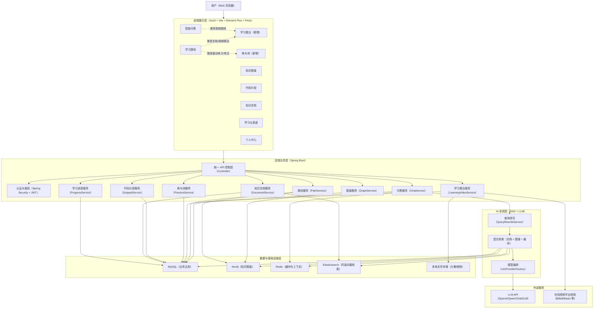

# 系统总体架构设计图（新增学习看台与练与测）

## 图示说明（新增模块影响）

1. `学习看台模块`新增了“本地视频检索/收藏/历史/观看进度”业务链路，并增加对在线视频平台检索与导入的外部依赖。
2. `练与测模块`新增了“练习与考试会话、答题判定、评分分级、记录沉淀”链路，核心数据落在 MySQL。
3. 学习闭环由“路径规划 -> 学习看台 -> 练与测 -> 进度分析”串联，问答模块可向学习看台推荐资源并形成联动。
